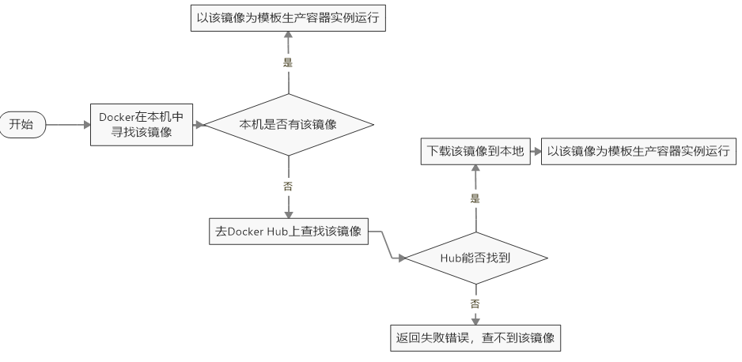

# 概述

**架构图**


`docker run` **执行流程**




**与虚拟机对比**

|            |       Docker容器        |        虚拟机（VM）         |
| :--------: | :---------------------: | :-------------------------: |
|  操作系统  |     与宿主机共享OS      |   宿主机OS上运行虚拟机OS    |
|  存储大小  | 镜像小，便于存储与传输  |          镜像庞大           |
|  运行性能  |   几乎无额外性能损失    | 操作系统额外的CPU、内存消耗 |
|   移植性   | 轻便、灵活，适应于Linux | 笨重，与虚拟化技术耦合度高  |
| 软件亲和性 |     面向软件开发者      |       面向硬件运维者        |
|  部署速度  |       快速，秒级        |        较慢，10s以上        |

# 常用命令

## 镜像命令

- `docker images [OPTIONS] [REPOSITORY[:TAG]]`

- `docker search [OPTIONS] TERM`

- `docker pull [OPTIONS] NAME[:TAG|@DIGEST]`

- `docker system df [OPTIONS]`

- `docker rmi [OPTIONS] IMAGE [IMAGE...]`

  ```shell
  docker rmi -f 镜像ID
  docker rmi -f 镜像名1:TAG 镜像名2:TAG
  docker rmi -f $(docker images -qa)
  ```

- 

## 容器命令

- `docker run [OPTIONS] IMAGE [COMMAND] [ARG...]`

  ```shell
  # 常用OPTIONS
  --name="容器名称"	 为容器指定一个名称
  -d								启动守护式容器
  -i								以交互模式运行容器
  -t								为容器重新分配一个伪输入终端
  -P								随机端口映射
  -p								指定端口映射
  ```

- `docker ps [OPTIONS]`

- 


虚悬镜像 dangling image

